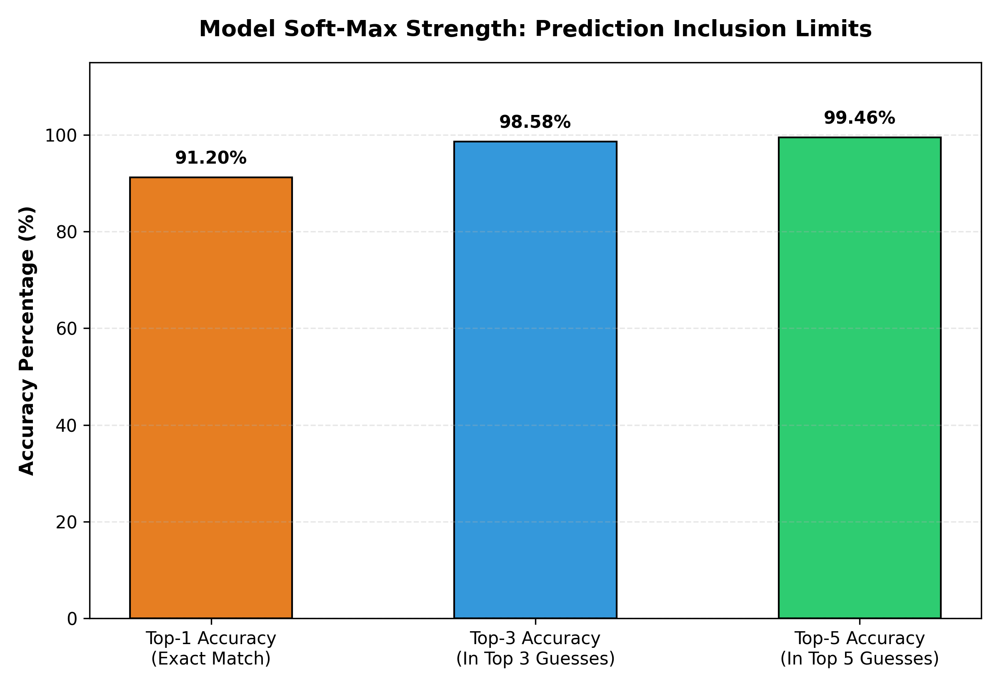

# Core Pet Breed Classifier Engine

### 🐾 Internship Capstone Project | Production Prototype
An end-to-end deep learning system designed to classify 37 distinct breeds of dogs and cats with high precision. This system utilizes Transfer Learning with a frozen Google MobileNetV2 backbone and features a decoupled web prototype for real-time testing.

## 📊 Performance Summary
* **Validation Accuracy:** 91% (across 1,478 unseen validation images)
* **Macro Average F1-Score:** 0.91
* **Weighted Average F1-Score:** 0.91
* **Architecture:** MobileNetV2 (Feature Extractor) + Custom Dense/Dropout Classification 

## 📊 Model Soft-Max Strength (Top-k Evaluation)
To analyze the fine-grained classification reliability of the model across 37 highly similar pet breeds, the system was evaluated using Top-k soft-max distribution boundaries:

* **Top-1 Accuracy (Exact Match):** 91.20%
* **Top-3 Accuracy (In Top 3 Predictions):** 98.58%
* **Top-5 Accuracy (In Top 5 Predictions):** 99.46%



When the model misclassifies a specific breed on its primary guess, the true target class resides within its secondary or tertiary predictions **98.58% of the time**. This demonstrates that the feature extraction layer isolates highly logical, fine-grained visual characteristics instead of generating chaotic errors.

## 📊 Dataset Information
This project utilizes the public **Oxford-IIIT Pet Dataset**. 
Since the raw images are ignored by Git to keep the repository lightweight, you must set them up manually to run the scripts locally:

1. Download the images from the official dataset source.
2. Create a folder named `oxford_pet_dataset` in the root of this project.
3. Extract all the images directly into that folder so the paths look like: `Pet_Classifier_Capstone/oxford_pet_dataset/Abyssinian_1.jpg`.

## 📂 Project Architecture
```text
Pet_Classifier_Capstone/
│
├── oxford_pet_dataset/           <-- Source training data
├── my_pet_classifier_model.keras <-- Pre-trained model weights
│
├── pet_classifier.py            <-- Pipeline execution & training loop
├── evaluate.py                  <-- Automated metrics & classification reporting
├── predict.py                   <-- Isolated local CLI inference script
├── app.py                       <-- Gradio production web dashboard
└── requirements.txt             <-- Environment dependency manifest

